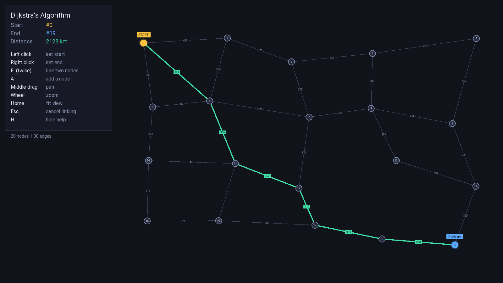

# Dijkstra Visual

An interactive visualization of Dijkstra's shortest path algorithm, written in C++17 with [SFML](https://www.sfml-dev.org/).



Pick a start and an end node and the shortest route lights up immediately. Edit the graph while the program is running and the result is recalculated on the fly.

## Features

- Build a graph from files or generate a random connected one
- Left click sets the start, right click sets the end, the shortest path and its length are highlighted
- Add nodes and links with the keyboard, with no restart needed
- Smooth zoom towards the cursor, panning, resizable window, anti-aliased graphics
- Hover over a node to see its distance from the start
- Nodes that can't be reached from the start are dimmed

## Controls

| Input          | Action                                                    |
| -------------- | --------------------------------------------------------- |
| Left click     | Set the start node                                        |
| Right click    | Set the end node                                          |
| `F` (twice)    | Hover a node and press `F`, then hover another one and press `F` to link them |
| `A`            | Add a node under the cursor                               |
| Middle drag    | Pan the view                                              |
| Mouse wheel    | Zoom                                                      |
| `Home`         | Fit the whole graph into the window                       |
| `Esc`          | Cancel a link that is being created                       |
| `H`            | Show or hide the help panel                               |

Shortcuts use physical key positions, so they work on any keyboard layout.

## Building

You need a C++17 compiler and CMake 3.16 or newer. SFML 2.6 is used from the system if it is installed, otherwise CMake downloads and builds it.

```sh
# Debian / Ubuntu: optional, saves a download
sudo apt install libsfml-dev

cmake -S . -B build
cmake --build build
./build/dijkstra-visual
```

On Windows with Visual Studio:

```bat
cmake -S . -B build
cmake --build build --config Release
build\Release\dijkstra-visual.exe
```

The `assets` and `data` folders are copied next to the executable after each build.

## Running

```sh
./dijkstra-visual                 # asks how to build the graph
./dijkstra-visual --random 40     # random graph with 40 nodes
./dijkstra-visual --file          # data/points.txt and data/graph.txt
./dijkstra-visual --points my-points.txt --graph my-graph.txt
```

## Data files

A graph is described by two plain text files.

`points.txt` has one node per line, as `x y` coordinates. Nodes are numbered from 0 in the order they appear.

```
200 160
620 480
1040 160
```

`graph.txt` has one link per line, as the numbers of the two nodes it connects. Links are undirected and their weight is the distance between the nodes, rounded to an integer.

```
0 1
1 2
0 2
```

Invalid or duplicate links are skipped with a message on stderr.

## Project layout

```
src/
  main.cpp       command line and graph setup
  App.*          window, input handling and camera
  Renderer.*     drawing the graph and the overlay
  Theme.hpp      colours
  Config.hpp     sizes and limits
  Graph.*        graph with nodes on a plane
  Dijkstra.*     the algorithm (binary heap, O((V + E) log V))
  GraphIO.*      loading files and random generation
assets/          font
data/            sample graph
```

The font is [Roboto](https://fonts.google.com/specimen/Roboto), licensed under the Apache License 2.0.
